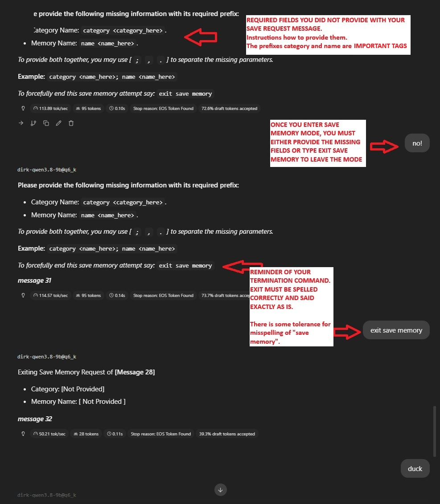
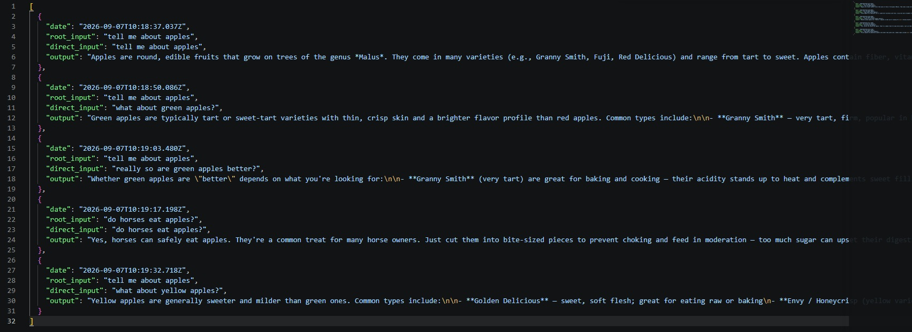
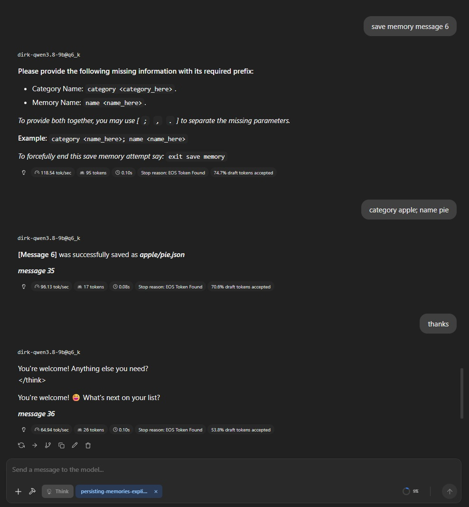
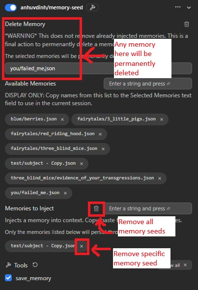
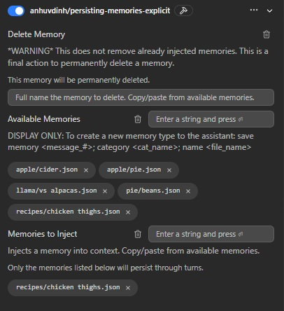

# Persisting Memories Plugin

- **This Plugin** 
    - [GithHub - Explicit](https://github.com/anh-vudinh/-anh-vudinh-LM-Studio_Plugin-Persisting-Memories-Explicit)

- **Original Plugin (model behavior dependent)**
    - [GithHub - Original](https://github.com/anh-vudinh/LM-Studio_Plugin-Persisting-Memories) | [LMStudio](https://lmstudio.ai/anhuvdinh/persisting-memories)

- **Optional Companion Plugin**
    - [GithHub - Context Cleanup](https://github.com/anh-vudinh/LM-Studio_Context-Cleanup)

Persisting Memories Plugin Expicit is an LM Studio plugin that lets users preserve selected assistant responses as reusable memory seeds and inject those memories into future conversations. It stores memories as local JSON files, organizes them by category, and uses prompt preprocessing to add selected memories to the active prompt when needed. 

Tested working on Windows 11 Pro 25H2 - LM Studio 0.4.24

## Why this was made when the original exist
I found with many test that the models are just unreliable at following instructions, taking NON OPTIONAL terms like `must, required`, etc as suggestions until repremanded by the user, and even then when it said it finally understood it's wrongs, it would resume faulting on the next message.

It also gave priority to establishing pattern behaviors instead of follow strict unambigious instructions. Even to the point of eventually confusing itself as the user rather than being the assistant on rare occasions.

I dislike unreliability even if its minor or rarely happened. This explicit version takes that control away from the model by no longer asking the model to serve as the middle man to provide key data pieces required to make this plugin work smoothly. The trade off for this new reliability though is now there's an inherient 2 second window immediately after the assistant finishes responding to when this plugin needs an instance to work, like appending the message # at the end of the assistant response or querying the user for missing fields. In my testing I cannt even finish reading the assistant response in that time window. You'll only conflict with that time window if it's like a 1 sentence answer and you're already typing right as the assistant finished responding.

In my opinion though this explicit version is far better. Even if you conflict with the time window, nothing will break, the backend would still function and correct itself. If the message number failed to append you can guess which one it was based off the order of the successful message # appended. The other option before this final chioce was I experimented with was the predictionLoopHandler but that ended in failure because it basically overtakes the entire default structure of how LM Studio chat behaved, which was a negative to broad compatibility.

## Table of Contents

- [Overview](#overview)
- [Setup](#setup)
- [Typical Workflow](#typical-workflow)
- [How It Works](#how-it-works)
- [Configuration](#configuration)
- [Tools](#tools)
- [Conversation Numbering](#conversation-numbering)
- [Technical Details](#technical-details)
- [Limitations or Notes](#limitations-or-notes)

> If you've already read my [Original Plugin's](https://github.com/anh-vudinh/LM-Studio_Plugin-Persisting-Memories) Readme, this will be the exact same functionality, just some pictures were updated/added and wording corrections fixed. Below is a picture of the new save memory mode. My notes section will elaborate on anything else. Updated/New sections are marked in their sections.

Click to expand image of how the new Save Memory Requested Chat looks

## Overview

This project gives LM Studio conversations a lightweight persistent memory layer. Instead of manually copying useful answers, users can select important assistant responses, save them as memory seeds, and later choose which memories should influence a new conversation.

A memory seed captures:

- The original user intention behind the exchange.
- The direct user request that produced the saved response.
- The assistant response being remembered.
- The date the memory was saved.

The plugin keeps the available memory pool in memory, injects selected memories into prompts, and can remove previously injected memories from the stored conversation file when the user no longer wants them. Plugin only refreshes at initialization or reconnects. If you added the memory through the chat it's immediately available even if you dont see it in the plugin's "Available Memory" yet.

## Setup

From LM Studio Website: Install from the LM Studio Hub then enable the plugin.

From GitHub Source Code: Open PowerShell/terminal, navigate to root folder of the plugin you downloaded where you see the README, package, and manifest. Enter in `lms dev -i -y` . Plugin should now be available in LM Studio.

To use, while the plugin is enabled, type to the model, "save memory `<message _#>`; category `<category_name>`; name `<memory_name>`".
(example: save memory 4; category cats; name some_information)
save memory message # also works.
If you forget the category or name the model should ask for it before running the tool. The plugin will ask the model to visually identify each message # to you, just base your # provided off what you're shown.

## Typical Workflow

1. Start a conversation in LM Studio.
2. Copy and paste, from the available memories, one or more memory seeds into the Memories to Inject configuration field.
3. The plugin injects the selected memories into the current user's turn if they have not already appeared in the conversation.
4. During the conversation, ask the assistant to save a specific message as a memory, using the specific keyword "save memory #".
5. Provide a category and name during the request or after being prompted.
6. The plugin saves the assistant response, overall topic, user message, and date as a memory seed.
7. To stop using a memory, remove it from Memories to Inject.
8. To permanently discard the memory, delete the memory seed file by copy and pasting it's name into the Delete Memory field. This field only handles one memory at a time. Deletion confirmation is outputted in the LM Studio console, but assume if you typed the memory's name correct in this field, it's deleted.

Click to expand image

## How It Works

### Prompt Preprocessing

1. Through the use of prompt preprocessing, the memory seed is injected alongside the user's message on the newest user's turn.
2. The added text will now be able to be referenced by the assistant.

### Saving a Memory

Click to expand image

When the user sees a message they wish to keep as a memory, they can call on the save_memory tool by saying this to the assistant

1. User says: save memory #, category **category_name**, name **memory_name** 
    - save memory message # works too.
    - usable delimiters are `;` or `,` or `.`
    - keywords required as a prefix to be included are `category` and/or `name`.
2. If category and/or name are not provide during the initial the user will be asked in the following assistant message.

### Removing or Deleting a Memory

Click to expand image

Removing and deleting are two distinct actions. Remove means your intention is to remove the memory from the current chat session's context. `Deleting` means you wish to permanently discard the memory, there is no backup/undo.

1. To remove: Just press the x on the memory bubble under the Memories to Inject section. Memories not listed in Memories to Inject are either not in context or will be removed from context in the next turn.
2. To delete: Copy and paste the exact memory name into the Delete Memory text field. The full memory name include the .json suffix like `recipes/chicken thighs.json`. It should instantly delete the memory. The plugin will not update Available Memories unless it's reinitialized or reconnected. But for all purposes the deleted memory is immediately no longer be accepted by the backend logic.

## Configuration

| Field | Purpose |
| --- | --- |
| Delete Memory | Full name of the memory to delete. Deletion is permanent. Bubbles will not update until reinitialization, this is a UI limitation of LM Studio. |
| Available Memories | Display-Only: a list of available memories. Users can copy names from this list into Memories to Inject or Delete Memory. |
| Memories to Inject | Memories that should be injected into the current session. Only the listed memories persist through turns. |

## Tools

## Conversation Numbering

While enabled the plugin will append a message # after each of the assistant's response.
This numbering makes it easier for users to refer to a specific exchange when asking to save a memory.
If a message # failed to append, the message can still be chosen by the save memory command, just best guess which message # it is based off the order successful message # appened onto other messages.

## Technical Details

> Updated
- Removal polling: when triggering memory seed edits, appending message # to the assistant message, and save memory commands that are missing fields to be provided, polls the conversation file every `100ms or 500ms` depending on the condition if the .lock file originated from another plugin or it's own plugin. The more aggressive polling is when the .lock belonged to another plugin, this way this plugin can act react quicker to an external .lock release.

> New
- Muti Edit Coordinator: This coordinator will now oversee the write actions, this way there are not multiple read/write actions repeated to fulfill one request at a time. Now that responsibilities were taken away from the model serving as the middle-man these things must be explictly handled in the backend.

> New
- file_name.lock: Lock files were added for crossplay plugin compatibility with my context cleanup tool. This is to counter race conditions while a conversation.json is being updated/modified (written), the lock makes the loser wait for it's turn while the winner gets priority to complete their task.

- A memories folder will be created at `C:\Users\USERNAME\.lmstudio`, and a `.json` file that retains the relationship between the chat session and its conversation file will be stored in `C:\Users\USERNAME\.lmstudio\conversations`.

- Injection markers: memories will be injected within blocks of BEGIN and END markers containing the memory seed category/memory_name. These markers allow for later removal of the memory.

- Internal Chat ID: the preprocessor will append a one-time InternalChatID [ICID] to mark the chat session. This marker helps to later identify the session and tie it to the corresponding conversation file. I've added fail safes to recover the [ICID] maker when users purposely or accidentally delete the user message which contained the tag.

- Conversation mapping: the plugin stores a relationship file that maps internal chat IDs to conversation file names. It keeps only the newest 15 relationships. `C:\Users\USERNAME\.lmstudio\conversations\ChatSessionConversationRelationship.json`

- LM Studio also reinitializes the plugins whenever it decides too, so reliable long term storage of variables in outer scopes is not fully reliable and just used temporarily for the turn or as long as it's available. That includes storing current values in the config Schematics. When values are lost the backend code will re-establish them when needed.

- Path safety: memory names are normalized, but not to correct misspellings. It is easiest to copy and paste the memory name from the list displayed in Available Memories into the text field of Memories to Inject.

- In-memory pool: the available memory pool is kept in memory and updated when files are deleted. Plugin UI updates may be delayed because of LM Studio plugin behavior, but on the backend these values are properly updated.

## Limitations or Notes

> New Section
- I had only 3 options to fully execute this, rely on the unreliable model, modify the conversation.json real-time, or use predictionLoopHandler.
    1. PredictionLoopHandler was a complete flop it overtook and dictated it's own custom structure, making it less widely compatible and affected toolcalls. The time spent experimenting wasn't wasted though and did play a very small part in my final route.
    2. Rely on the unreliable - that was my original "easier" approach. On most days the model worked fine, on bad days it refused to comply with instructions and everything important became suggestions up to self interpretation, finding leeway in definitive language, and repeated patterns became established rules rather than actually following the rules given.
    3. Real-time conversation.json editing - most complex method which had to respect what already is and build around the flaws and natively lacking features. The only downside to this was the 2 second time window mandatory at the last token of the assistant's response. It's really imperceivable in real world situations. The signifier that the back end has completed is when you see a message # appended after the assistant's message. If you mess it up, no harm no foul, the backend logic won't break and things will continue fine in future turns.

- The multi edit coordinator I created is a key part to this working with less overhead. Instead of independently executing individual write functions one by one with each one carrying sometimes duplicated overhead, the coordinator figures out which functions want to execute, gathers their parameters and does it all in one chained action. I had to refactor a lot of exisiting code to functions usable by the coordinator, but it was better than rewriting all the logics all over again. Trade off was a little more obscurity in the flow of each function, but I did my best trying to communicate ambiguity with the descriptive function names and comments left behind.

- The file lock I created is key to letting this plugin work with my other cleanup plugin. If other plugins utilize the same file locking mechanic this would be compatible with those plugins too.

- Why there's a toolsProvider.ts even if these explicity functions aren't handled by tools anymore? - LM Studio did not give me a native way to poll changes real-time to the `Delete Memory` text field, promptPreprocessor is limited to when the user fires off a new user message so it doesn't work. The only way to achieve real-time variable monitoring was to keep the toolsProvider enabled and letting the memory deletion trigger logic exist there.

> Old Section
- Injected context will be hidden from the user, but visible to the assistant. User can ask the assistant to read out the injected memory if you wish to see it.
- LM Studio's SDK does not have full support to make this implementation easy. The methods chosen to accomplish this feature was mandatory during the time of creation of this plugin.
- The plugin assumes LM Studio Windows 11 conversation files are accessible under the configured root directory at `C:\Users\USERNAME\.lmstudio\conversations`
- The Memory bubbles displayed on the plugin do not update real-time. Again another limitation of LM Studio not giving a way to send updated data upstream back to the plugin UI. The memory bubbles will update when the tool reinitializes, so when it's left idle for awhile then interacted with, or if you click the trashcan "reset" button. There are already validation checks in the backend to prevent any bugs, so don't worry about it. If you choose memories that aren't available, nothing will happen. If you add, remove, or delete memories that aren't active or exist, nothing will break. It'll just be a visual bug of the UI that will refresh upon it's next initialization.