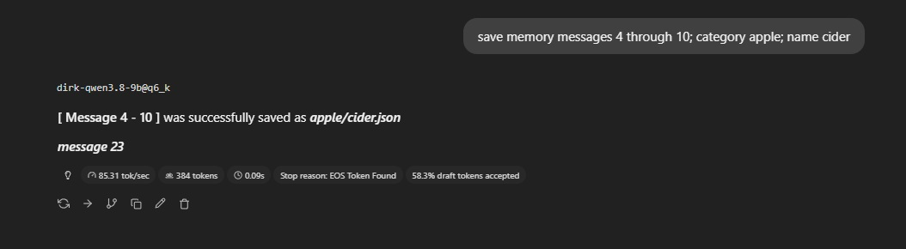
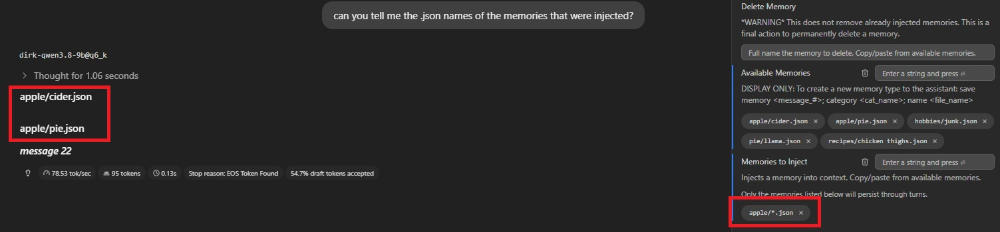
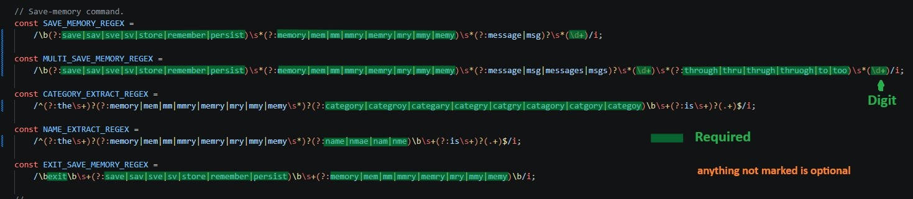
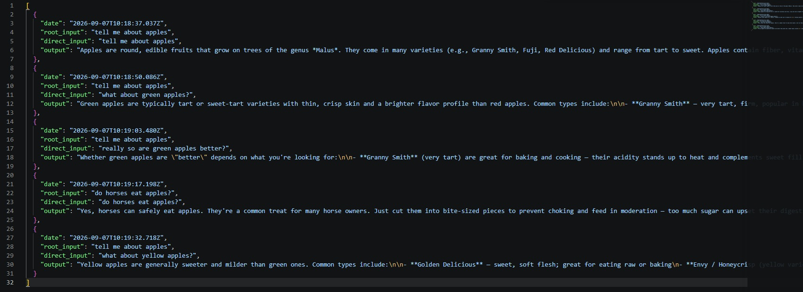
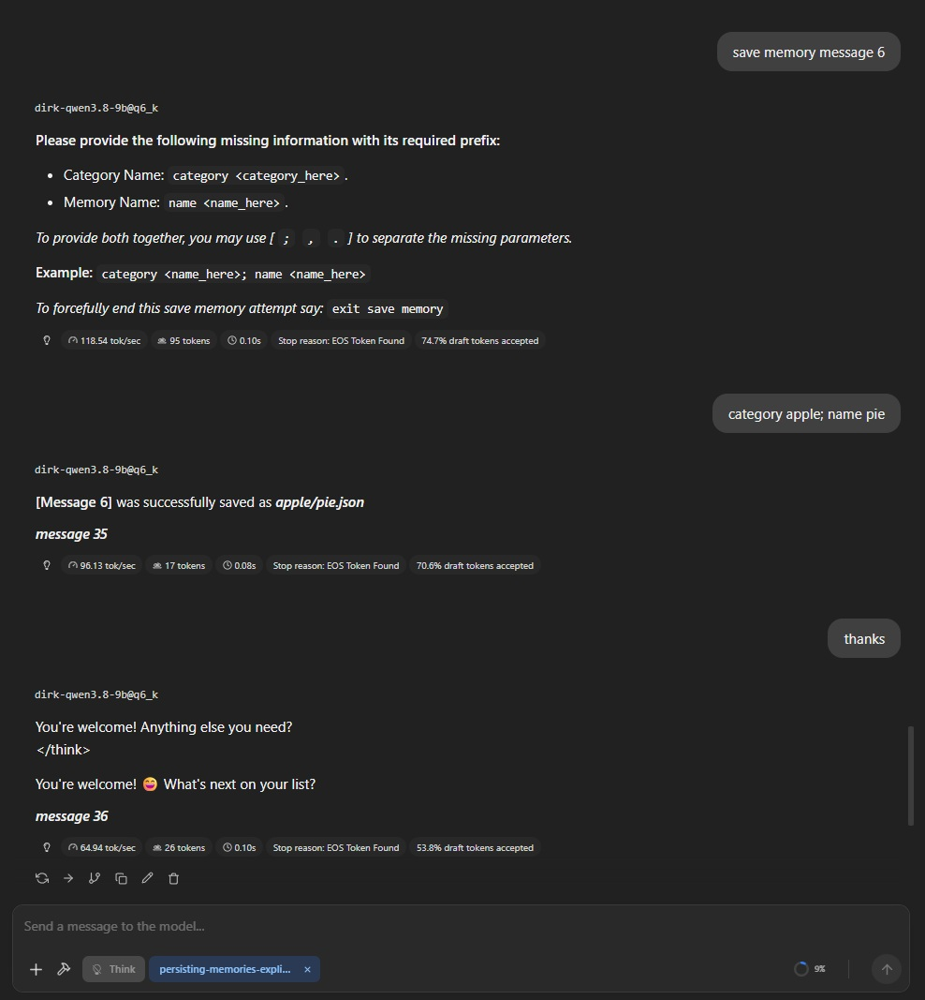
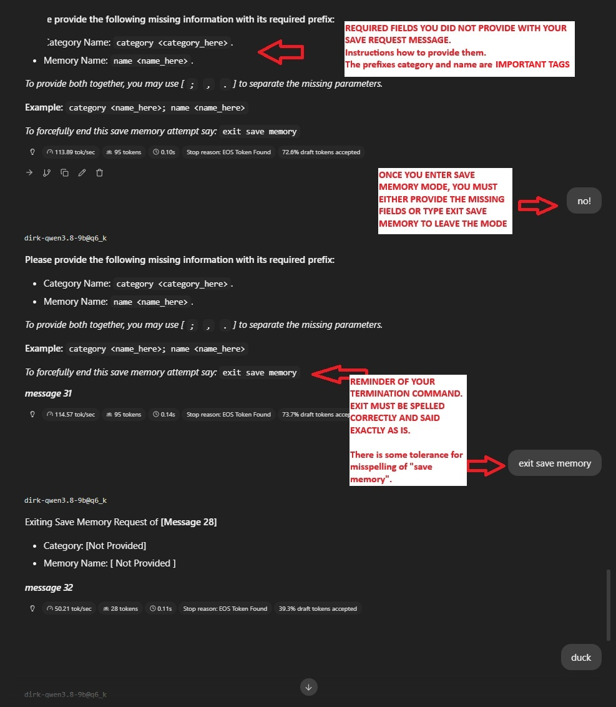
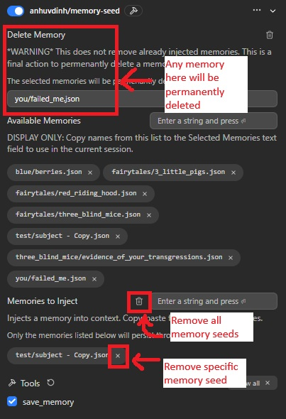
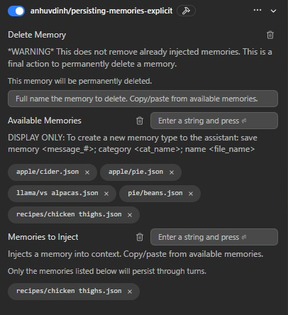

# Persisting Memories Explicit Plugin for LM Studio

- **This Plugin** - [GitHub - Explicit](https://github.com/anh-vudinh/-anh-vudinh-LM-Studio_Plugin-Persisting-Memories-Explicit) | [LMStudio](https://lmstudio.ai/anhuvdinh/persisting-memories-explicit)

- **Original Plugin (model behavior dependent)** - [GitHub - Original](https://github.com/anh-vudinh/LM-Studio_Plugin-Persisting-Memories) | [LMStudio](https://lmstudio.ai/anhuvdinh/persisting-memories)

- **Optional Companion Plugin** - [GitHub - Context Cleanup](https://github.com/anh-vudinh/LM-Studio_Context-Cleanup) | [LMStudio](https://lmstudio.ai/anhuvdinh/context-cleanup)

Persisting Memories Plugin Explicit is an LM Studio plugin that lets users preserve selected assistant responses as reusable memory seeds and inject those memories into future conversations. It stores memories as local JSON files, organizes them by category, and uses prompt preprocessing to add selected memories to the active prompt when needed.

Tested working on Windows 11 Pro 25H2 - LM Studio 0.4.24

## Bug fix (10/3/2026)

1) I thought I had accounted for the conversation file sitting within a nested folder, turns out I did not finish up the full implementation. My plugin could find the nested file but couldn't path to it afterwards if it were nested. It assumed the file was directly living in conversations root folder. The logic has now been finished up so you can organize your conversations into sub folders and the plugin should be able to still pin point it. 

## New/Updated (10/2/2026)

1) Added batch memory save, `save memory <message #> to <message #>; category <category>; name <name>`.
   User messages that are just save memory commands will be filtered out and not saved to the file during the batch process.
   

   
Click to expand Picture of memory wild card inject.

   
   

 

2) Added wild card behavior to injecting memory seeds. `<category_folder>/*.json` will inject all memory files within that category folder.
    Users will not be allowed to create a fle named `*` or `*.json` to protect this feature. (memory/file names like `few*many` will be allowed)
   

   
Click to expand Picture of wild card.

   
   

 

3) Added wild card behavior to deleting memories. `<category_folder>/*.json` will delete that entire category folder. Be warned, the moment you complete that name to delete up to the last `n` of `.json` and it is a valid existing folder, it's gone, there is no recovery.
   

   
Click to expand Picture of category wild card delete.

   
   

 

4) Standarized save memory regex between the this plugin and my other model dependent and context cleanup plugins.

5) Imported the more advanced acquirelock(current this plugin has a basic need of acquirelock but it's for future proof) and my improved ICID and CFN scan logics.

6) Loosened some constraints on a failing save memory condition where user's message was a save command or meta data that was fully scrubbed. Fixed the placement of the input scrubbing, I was cleaning the input too early in the chain. Loosening it so it would not be corrected at the first step but at the last step.

7) Moved some variables to module-level states living in config.ts

8) The following isn't new but I never specifically went over them and think users should know the leeway and options they have for the spelling of the save command.
   
   *(Example: ***svmem4*** will be accepted and so will with ***store mmry msg4***. the category is apple). Batch memory save requires a variation of through/to as a trigger and ending message number*

   

   
Click to expand Picture of Save Memory command verbage

   
   

 

## Final Thoughts

I believe I've made this plugin's features rich enough to cover any angle a user might want to utilize or try and break this plugin through typical use. I'm also out of ideas of any avenues of expansion. Really the only two big flaws are on LM Studio's part, 1) No pathway to update the plugin-UI in real-time, and 2) The 2 second window after the assistant's lastest response must be respected or any updates will be overwritten by a cached version. Those are beyond my control. Unless LM Studio fixes those quirks this is probably the final version I'm sticking with unless I spot bugs during my personal use.

## Why this was made when the original exists

Click to expand Reading Section

This version was made for reliability, a misbehaving model doesn't get to determine the outcome of this plugin's functionality. The model dependent version is snappier in most regards but a misbehaving model may diminish all that advantage by giving you headaches from simply being unable to properly follow instructions to number messages, when to and when not to call the tool, treating preprocessed message tags as jailbreak attempts and refusing to comply, taking non-optional unambigious language as suggestions up to it's own determination, or using patterns to establish rules rather than follow rules clearly given by the user.

In my opinion though the explicit version is far better. Even with the 2 second inherient window required after the assistant finishes it's response. Even if you conflict with the time window, nothing will break — the backend would still function and correct itself. If the message number failed to append, you can guess which one it was based off the order of the successful message # appended. The other option before this final choice was I experimented with `predictionLoopHandler` but that ended in failure because it basically overtakes the entire default structure of how LM Studio chat behaves, which was a negative for broad compatibility.

## Table of Contents

- [Overview](#overview)
- [Setup](#setup)
- [Typical Workflow](#typical-workflow)
- [How It Works](#how-it-works)
- [Configuration](#configuration)
- [Tools](#tools)
- [Conversation Numbering](#conversation-numbering)
- [Technical Details](#technical-details)
- [Limitations or Notes](#limitations-or-notes)

> If you've already read my [Original Plugin's](https://github.com/anh-vudinh/LM-Studio_Plugin-Persisting-Memories) README, this will be the exact same functionality. Just a different method to achieve the same goal. Better in my honest opinion. Some pictures were updated/added and wording corrections fixed. Below is a picture of the new save memory mode. My notes section will elaborate on anything else. Updated/New sections are marked in their respective sections.

## Overview

This project gives LM Studio conversations a lightweight persistent memory layer. Instead of manually copying useful answers, users can select important assistant responses, save them as memory seeds, and later choose which memories should influence a new conversation.

A memory seed captures:

- The original user intention behind the exchange.
- The direct user request that produced the saved response.
- The assistant response being remembered.
- The date the memory was saved.

The plugin keeps the available memory pool in memory, injects selected memories into prompts, and can remove previously injected memories from the stored conversation file when the user no longer wants them. Plugin only refreshes at initialization or reconnection. If you added the memory through the chat it's immediately available even if you don't see it in the plugin's "Available Memory" yet.

## Setup

From LM Studio Website: Install from the LM Studio Hub then enable the plugin.

From GitHub Source Code: Open PowerShell/terminal, navigate to root folder of the plugin you downloaded where you see the README, package, and manifest. Enter `lms dev -i -y`. Plugin should now be available in LM Studio.

To use, while the plugin is enabled, type to the model: `"save memory <message #>; category <category_name>; name <memory_name>"`. (example: save memory 4; category cats; name some_information). `save memory message #` also works. If you forget the category or name, the model should ask for it before running the tool. The plugin will ask the model to visually identify each message # with you — just base your # provided off what you're shown.

## Typical Workflow

1. Start a conversation in LM Studio.
2. Copy and paste, from the available memories, one or more memory seeds into the **Memories to Inject** configuration field.
3. The plugin injects the selected memories into the current user's turn if they have not already appeared in the conversation.
4. During the conversation, ask the assistant to save a specific message as a memory, using the specific keyword `"save memory #"` (example: `save memory 5; category recipes; name chicken thighs`).
5. Provide a category and name during the request or after being prompted.
6. The plugin saves the assistant response, overall topic, user message, and date as a memory seed.
7. To stop using a memory, remove it from **Memories to Inject**.
8. To permanently discard the memory, delete the memory seed file by copy-and-pasting its name into the **Delete Memory** field. This field only handles one memory at a time. Deletion confirmation is outputted in the LM Studio console, but assume if you typed the memory's name correctly in this field, it's deleted.

Click to expand image

## How It Works

### Prompt Preprocessing

1. Through the use of prompt preprocessing, the memory seed is injected alongside the user's message on the newest user's turn.
2. The added text will now be able to be referenced by the assistant.

### Saving a Memory

Click to expand image of successful save memory attempt

 
When the user sees a message they wish to keep as a memory, they can call on the `save_memory` tool by saying this to the assistant:

1. User says: `save memory #`, category <**category_name**>, name <**memory_name**>
   - `save memory message #` works too.
   - Usable delimiters are `;` or `,` or `.`
   - Keywords required as a prefix to be included are `category` and/or `name`.
2. If category and/or name are not provided during the initial user message, the user will be asked in the following assistant message.

   

   
Click to expand image of the exiting Save Memory Mode

   
   

### Removing or Deleting a Memory

Click to expand image

Removing and deleting are two distinct actions. **Remove** means your intention is to remove the memory from the current chat session's context. **Deleting** means you wish to permanently discard the memory — there is no backup/undo.

1. To remove: Just press the X on the memory bubble under the **Memories to Inject** section. Memories not listed in **Memories to Inject** are either not in context or will be removed from context in the next turn.
2. To delete: Copy and paste the exact memory name into the **Delete Memory** text field. The full memory name includes the `.json` suffix like `recipes/chicken_thighs.json`. It should instantly delete the memory. The plugin will not update Available Memories unless it's reinitialized or reconnected. But for all purposes, the deleted memory is immediately no longer accepted by the backend logic.

## Configuration

| Field | Purpose |
| --- | --- |
| Delete Memory | Full name of the memory to delete. Deletion is permanent. Bubbles will not update until reinitialization — this is a UI limitation of LM Studio. |
| Available Memories | Display-only: a list of available memories. Users can copy names from this list into **Memories to Inject** or **Delete Memory**. |
| Memories to Inject | Memories that should be injected into the current session. Only the listed memories persist through turns. |

## Tools

## Conversation Numbering

While enabled, the plugin will append a message # after each of the assistant's responses. This numbering makes it easier for users to refer to a specific exchange when asking to save a memory. If a message # failed to append, the message can still be chosen by the `save memory` command — just best-guess which message # it is based off the ordering of successful message #s appended onto other messages.

## Technical Details

- Multi-Edit Coordinator: This coordinator now oversees the write actions, so there are not multiple read/write actions repeated to fulfill one request at a time. Now that responsibilities were taken away from the model serving as the middleman, these things must be explicitly handled in the backend. I had to refactor a lot of existing code into functions usable by the coordinator, but it was better than rewriting all the logics from scratch. Trade-off: a little more obscurity in the flow of each function, but I did my best trying to communicate ambiguity with descriptive function names and comments left behind.

- `file_name-persisting-memories-final-write.ready` is now a coordination file created within the conversation folder to let PM catch up to the CC plugin and take the lead at executing its functions first. Persisting Memories plugin creates the `.ready`; Context Cleanup is expected to remove it. There may be abandoned `.ready` leftover files if your model crashes — they're 0KB so they just exist without any actual content. You may want to manually clean up any abandoned `.ready` files if you wish they're no longer relevant. Putting an automatic cleaner in one of the plugins would be unnecessary overhead.

- `file_name.lock`: Lock files were added for cross-plugin compatibility with my Context Cleanup tool. This counters race conditions while a `conversation.json` is being updated/modified (written) — the lock makes the loser wait for its turn while the winner gets priority to complete their task.

- Removal polling: When triggering memory seed edits, appending message # to the assistant message, and save memory commands that are missing fields to be provided, polls the conversation file every `100ms` or `500ms` depending on the condition if the `.lock` file originated from another plugin or its own plugin. The more aggressive polling is when the `.lock` belonged to another plugin — this way this plugin can act quicker to an external `.lock` release.
- A `memories` folder will be created at `C:\Users\USERNAME\.lmstudio`, and a `.json` file that retains the relationship between the chat session and its conversation file will be stored in `C:\Users\USERNAME\.lmstudio\conversations`.
- Injection markers: Memories will be injected within blocks of `BEGIN` and `END` markers containing the memory seed category/memory_name. These markers allow for later removal of the memory.
- Internal Chat ID: The preprocessor will append a one-time InternalChatID `[ICID]` to mark the chat session. This marker helps identify the session and tie it to the corresponding conversation file. I've added fail-safes to recover the `[ICID]` marker when users purposely or accidentally delete the user message which contained the tag.
- Conversation mapping: The plugin stores a relationship file that maps internal chat IDs to conversation file names. It keeps only the newest 15 relationships. `C:\Users\USERNAME\.lmstudio\conversations\ChatSessionConversationRelationship.json`
- LM Studio also reinitializes plugins whenever it decides to, so reliable long-term storage of variables in outer scopes is not fully reliable and just used temporarily for the turn or as long as they're available. That includes storing current values in the Config Schematics. When values are lost, the backend code will re-establish them when needed.
- Path safety: Memory names are normalized, but not to correct misspellings. It's easiest to copy and paste the memory name from the list displayed in Available Memories into the text field of Memories to Inject.
- In-memory pool: The available memory pool is kept in memory and updated when files are deleted. Plugin UI updates may be delayed because of LM Studio plugin behavior, but on the backend these values are properly updated.

## Limitations or Notes

- I had only 3 options to fully execute this: rely on the unreliable model, modify the conversation.json real-time, or use `predictionLoopHandler`.
   1. **PredictionLoopHandler** was a complete flop — it overtook and dictated its own custom structure, making it less widely compatible and affecting tool calls. The time spent experimenting wasn't wasted though and did play a very small part in my final route.
   2. **Rely on the unreliable model** — that was my original "easier" approach. On most days the model worked fine; on bad days it refused to comply with instructions and everything important became suggestions up to self-interpretation, finding leeway in definitive language, and repeated patterns became established rules rather than actually following the rules given.
   3. **Real-time conversation.json editing** — the most complex method which had to respect what already is and build around the flaws and natively lacking features. The only downside to this was the 2-second time window mandatory at the last token of the assistant's response. It's really imperceptible in real-world situations. The signifier that the backend has completed is when you see a message # appended after the assistant's message. If you mess it up, no harm no foul — the backend logic won't break and things will continue fine in future turns.

- The multi-edit coordinator I created is a key part to this working with less overhead. Instead of independently executing individual write functions one by one with each one carrying sometimes duplicated overhead, the coordinator figures out which functions want to execute, gathers their parameters, and does it all in one chained action. I had to refactor a lot of existing code into functions usable by the coordinator, but it was better than rewriting all the logics all over again. Trade-off: a little more obscurity in the flow of each function, but I did my best trying to communicate ambiguity with descriptive function names and comments left behind.

- The file lock I created is key to letting this plugin work with my other cleanup plugin. If other plugins utilize the same file locking mechanic, this would be compatible with those plugins too. The `.ready` file is also key to forcing Context Cleanup to give priority of execution to Persisting Memories — otherwise CC reaches the lock creation 5–8ms faster on my system which may cause bugs like cleaning up messages that were required for the memory creation/associations.

- Why is there a `toolsProvider.ts` even if these explicit functions aren't handled by tools anymore? LM Studio did not give me a native way to poll changes real-time to the **Delete Memory** text field — promptPreprocessor is limited to when the user fires off a new user message so it doesn't work. The only way to achieve real-time variable monitoring was to keep the toolsProvider enabled and letting the memory deletion trigger logic exist there.

- Injected context will be hidden from the user, but visible to the assistant. User can ask the assistant to read out the injected memory if you wish to see it.
- LM Studio's SDK does not have full support to make this implementation easy. The methods chosen to accomplish this feature were mandatory during the time of creation of this plugin.
- The plugin assumes LM Studio Windows 11 conversation files are accessible under the configured root directory at `C:\Users\USERNAME\.lmstudio\conversations`.
- The Memory bubbles displayed on the plugin do not update real-time. Again, another limitation of LM Studio not giving a way to send updated data upstream back to the plugin UI. The memory bubbles will update when the tool reinitializes, so when it's left idle for awhile then interacted with, or if you click the trashcan "reset" button. There are already validation checks in the backend to prevent any bugs, so don't worry about it. If you choose memories that aren't available, nothing will happen. If you add, remove, or delete memories that aren't active or exist, nothing will break — it'll just be a visual bug of the UI that will refresh upon its next initialization.